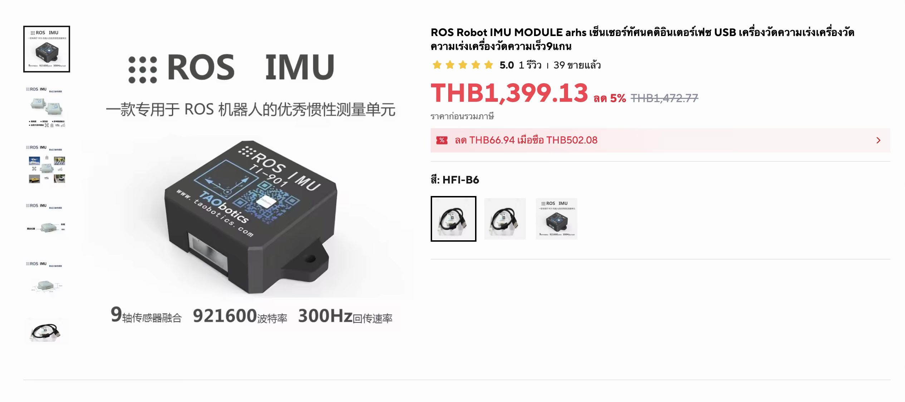
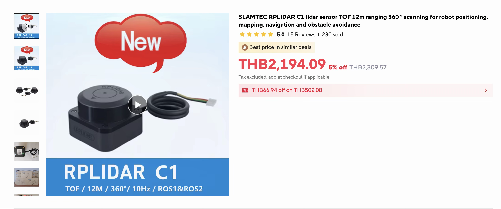
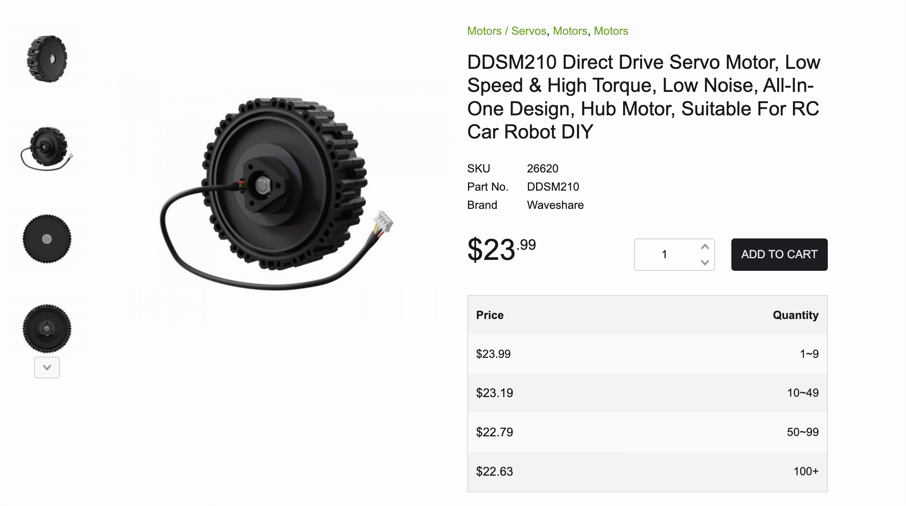
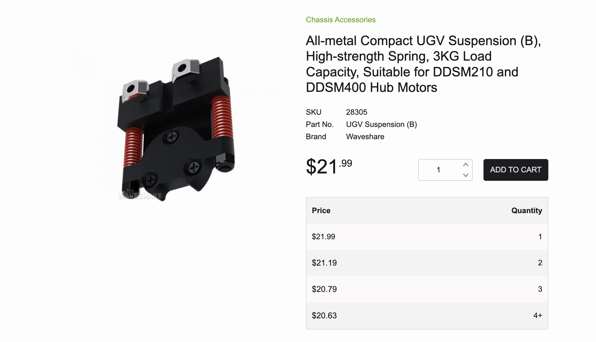
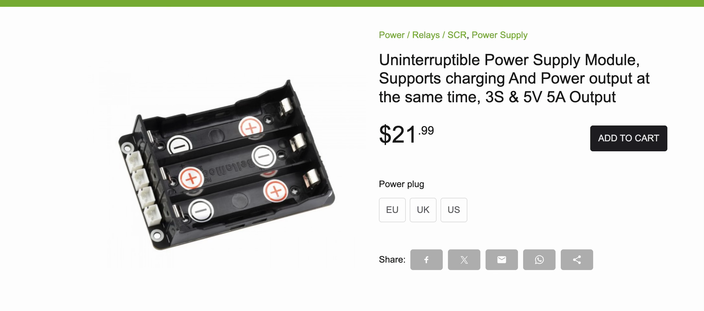
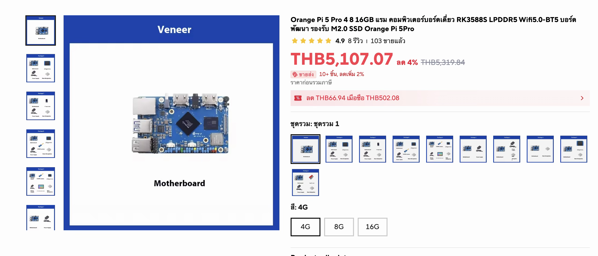

# ROS2 Robot Build

## Component Links & Images

### IMU
[AliExpress](https://th.aliexpress.com/i/1005006454314412.html)

---

### LIDAR
[AliExpress](https://th.aliexpress.com/i/1005006190309082.html)

---

### Motors – Waveshare DDSM210
[Waveshare](https://www.waveshare.com/product/ddsm210.htm)

---

### Suspension – Waveshare UGV Suspension B
[Waveshare](https://www.waveshare.com/product/ugv-suspension-b.htm)

---

### Battery – Waveshare UPS Module 3S
[Waveshare](https://www.waveshare.com/ups-module-3s.htm)

---

### Orange Pi 5 Pro
[AliExpress](https://th.aliexpress.com/i/1005006833124333.html)

---

## Bill of Materials (BOM)

| Component       | Cost (THB)            |
|-----------------|-----------------------|
| IMU             | 1,400                 |
| LIDAR           | 2,200                 |
| Motors          | $24 × 2 × 33 = 1,584  |
| Suspension      | $23 × 2 × 33 = 1,518  |
| Battery         | $22 × 33 = 726        |
| Orange Pi 5 Pro | 5,200                 |
| **Total**       | **12,638**            |
